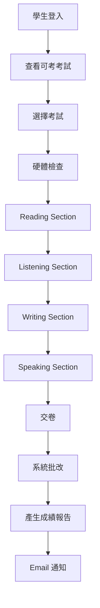
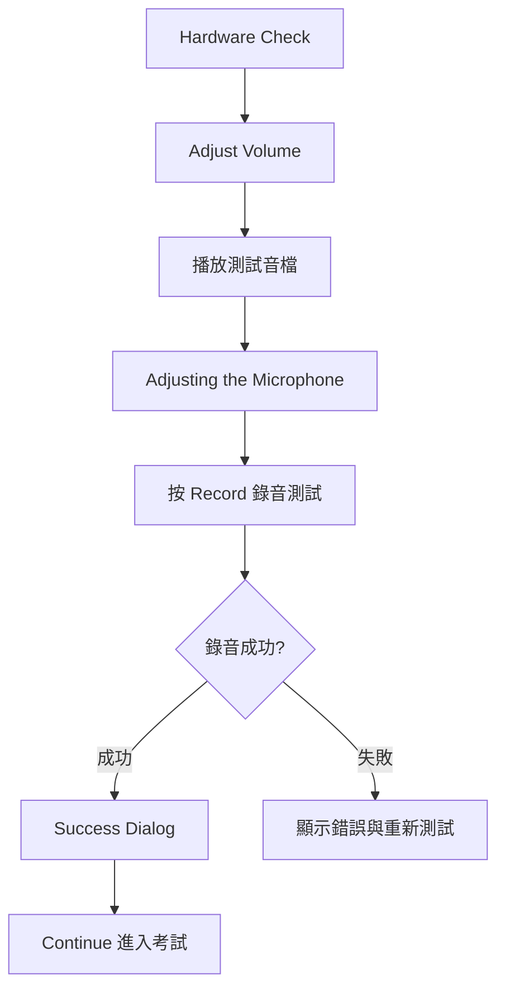
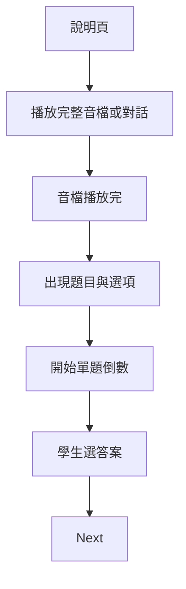
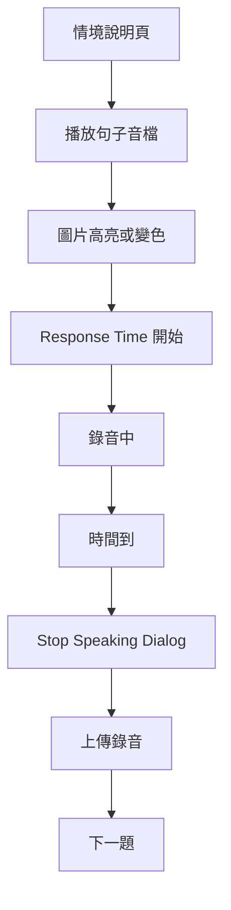
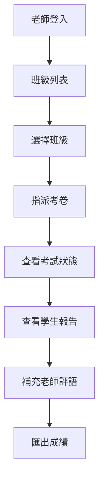
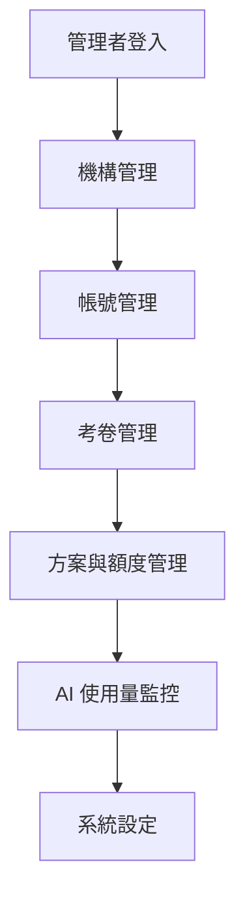

# 03. 使用者流程與 UI/UX 規格（Flow & Wireframe Spec）

> 文件版本：v1.0  
> 依據：TF 介面 PDF 原型 + 固定整卷考卷需求  
> 適用端：學生端、老師端、管理端

---

## 1. 整體使用者流程

---

## 2. 學生端主流程

### 2.1 登入頁

#### 元件

- Email 輸入框
- Password 輸入框
- Login 按鈕
- Forgot Password 連結

#### 行為

- 登入成功後依角色導向：
  - Student → 可考考試列表
  - Teacher → 老師後台
  - Admin → 管理後台

---

### 2.2 可考考試列表

#### 元件

- 考試名稱
- 指派老師
- 開放時間
- 截止時間
- 狀態：
  - 尚未開始
  - 可作答
  - 作答中
  - 已交卷
  - 批改中
  - 報告完成
- 開始 / 繼續 / 查看報告按鈕

#### 行為

- 未開放不可開始。
- 已超過截止時間不可開始。
- 作答中可繼續。
- 已完成可查看報告。

---

## 3. 考前硬體檢查流程

### 3.1 Hardware Check 畫面

#### 元件

- EXIT 按鈕
- Volume 按鈕
- Continue 按鈕
- 耳機、麥克風、喇叭 icon
- 說明文字

#### UX 規則

- 左上角所有「退出」文字統一改成 `EXIT`。
- 學生需先閱讀說明後按 Continue。

---

### 3.2 Adjust Volume 畫面

#### 元件

- Volume 控制
- 測試音檔播放
- Continue

#### UX 規則

- 學生可調整音量。
- 可重播測試音檔。
- 可進入麥克風測試。

---

### 3.3 Microphone Test 畫面

#### 元件

- 麥克風音量條
- Good / Too Loud 狀態提示
- Record 按鈕
- Success dialog

#### UX 規則

- 學生按 `RECORD` 後開始錄音測試。
- 錄音完成後出現 Success 視窗。
- 未完成麥克風測試不可正式開始 Speaking 相關考試。

---

## 4. Reading UI 規格

### 4.1 Reading Section 封面

#### 元件

- Section title：Reading Section
- 任務類型說明表
- Begin 按鈕

---

### 4.2 Module 說明頁

#### 元件

- Module title
- 時間規則說明
- Begin 按鈕

#### UX 規則

- Module 開始後，倒數才開始。
- Module 內可 Back。
- 進入下一 Module 後不可返回上一 Module。

---

### 4.3 Reading 題目頁

#### 元件

- 上方狀態列
  - EXIT
  - Section name
  - Question number
  - Countdown timer
  - Hide Time / Show Time
  - Review
  - Back
  - Next
- 題目區
- 文章區
- 選項區

#### UX 規則

- 題目出現時即開始倒數。
- Hide Time 後不顯示倒數，按鈕變成 Show Time。
- Review 顯示題目列表。
- Back 只在允許返回時顯示。
- Next 儲存答案並前往下一題。

---

### 4.4 Review 面板

#### 元件

- 題號列表
- 已作答狀態
- 未作答狀態
- 跳題按鈕
- 關閉按鈕

#### UX 規則

- 僅限 Reading 可 Review。
- Listening 不可 Review。

---

### 4.5 End of Module / End of Section

#### 元件

- End of Module 文字
- Next 按鈕
- End of Reading Section 文字

#### UX 規則

- End of Module 後按 Next 進入下一 Module。
- End of Section 後進入 Listening。

---

## 5. Listening UI 規格

### 5.1 Listening Section 封面

#### 元件

- Section title：Listening Section
- 任務說明表
- Begin 按鈕
- Volume 按鈕

---

### 5.2 Listening 題目頁

#### 元件

- 上方狀態列
  - EXIT
  - Section name
  - Question number
  - Countdown timer
  - Hide Time
  - Volume
  - Next
- 人物圖片或情境圖片
- 題目文字
- 選項

#### UX 規則

- 聽力音檔播放期間：
  - 選項灰階
  - 不可點選
  - 不顯示 Back
- 音檔播放完後：
  - 選項變黑
  - 可選答案
  - 顯示 Next
- Listening 只有 Next，沒有 Back。
- 每題可設定只播放一次。

---

### 5.3 Listening 對話 / 公告 / 學術演講

#### 流程

#### UX 規則

- 完整對話先播放，之後才進入題目。
- 題目頁可設定 20 秒倒數。
- 不可回上一題。

---

## 6. Writing UI 規格

### 6.1 Writing Section 封面

#### 元件

- Writing Section title
- 任務類型表
- Begin 按鈕

---

### 6.2 Build a Sentence

#### 元件

- 題目情境對話
- 空格區
- 可拖曳字詞
- 倒數時間
- Next / Back

#### UX 規則

- 共 10 題。
- 作答時間 6 分鐘。
- 使用滑鼠拖曳完成。
- 可依設定允許 Back。

---

### 6.3 Time Remaining 中介頁

#### 元件

- Time Remaining title
- 說明文字
- Back
- Continue

#### UX 規則

- Back 回到原題繼續修改。
- Continue 離開該題。
- 離開後不可返回該題。

---

### 6.4 Write an Email

#### 元件

- 左側 prompt
- 右側作答區
- To / Subject 顯示
- Cut
- Paste
- Undo
- Redo
- Hide Word Count
- 字數統計
- 倒數時間

#### UX 規則

- 作答時間 7 分鐘。
- 字數即時更新。
- 點擊 Hide Word Count 後隱藏字數。
- 系統定期自動儲存文字。

---

### 6.5 Academic Discussion

#### 元件

- 左側教授題目與要求
- 右側同學回應
- 作答區
- 工具列
- 字數統計
- 倒數時間

#### UX 規則

- 作答時間 10 分鐘。
- 建議顯示至少字數提醒。
- 作答內容送 AI 批改。

---

## 7. Speaking UI 規格

### 7.1 Speaking Section 封面

#### 元件

- Speaking Section title
- 任務類型表
- Begin 按鈕
- Volume 按鈕

---

### 7.2 Listen and Repeat

#### 流程

#### UX 規則

- 共 7 題。
- 每題答題時間可設定 8 / 10 / 12 秒。
- 沒有準備時間。
- 每少一個重要內容可扣分，實際扣分由 AI rubric 處理。
- 題目圖片在指定題次變色或高亮。
- 時間到顯示 Stop Speaking。

---

### 7.3 Virtual Interview

#### 元件

- Interviewer 圖片
- 題目音檔或題目文字
- Response Time
- 錄音狀態

#### UX 規則

- 共 4 題。
- 每題 45 秒。
- 沒有準備時間。
- 自動開始與停止錄音。
- 不可手動重錄，除非老師允許補考。

---

## 8. 狀態設計

### 8.1 Attempt 狀態

| 狀態 | 說明 |
|---|---|
| not_started | 尚未開始 |
| hardware_check | 硬體檢查中 |
| in_progress | 作答中 |
| submitted | 已交卷 |
| grading | 批改中 |
| completed | 報告完成 |
| expired | 逾時 |
| error | 錯誤 |

### 8.2 Audio 狀態

| 狀態 | 說明 |
|---|---|
| idle | 尚未開始 |
| recording | 錄音中 |
| stopping | 停止中 |
| uploading | 上傳中 |
| uploaded | 上傳成功 |
| failed | 上傳失敗 |

---

## 9. 老師端流程

---

## 10. 管理端流程

---

## 11. UI 一致性規則

- 所有左上角退出按鈕統一顯示 `EXIT`。
- 上方 bar 顏色與版型全 section 一致。
- Section 名稱固定顯示在左側。
- 倒數時間固定在右上區域。
- 禁用狀態使用灰階，同時需提供不可點選游標。
- 重要狀態不可只靠顏色表示，需搭配文字。
- 錄音、上傳、批改等等待狀態需顯示明確 loading。

---

## 12. 斷線與恢復 UX

| 情況 | 畫面處理 |
|---|---|
| 網路短暫中斷 | 顯示「正在重新連線」 |
| 自動儲存失敗 | 顯示「暫時無法儲存，請勿關閉頁面」 |
| 恢復連線 | 顯示「已恢復連線，答案已儲存」 |
| 音檔上傳失敗 | 顯示重新上傳按鈕 |
| 考試逾時 | 自動提交並導向批改中畫面 |

---

## 13. 批改中與報告完成頁

### 批改中頁面

#### 元件

- 批改中狀態
- Reading / Listening 已完成
- Writing / Speaking 批改中
- 預估等待說明
- 返回首頁按鈕

### 報告完成頁

#### 元件

- 總分
- 四科分數
- AI 評語摘要
- 查看完整報告
- 下載 PDF
