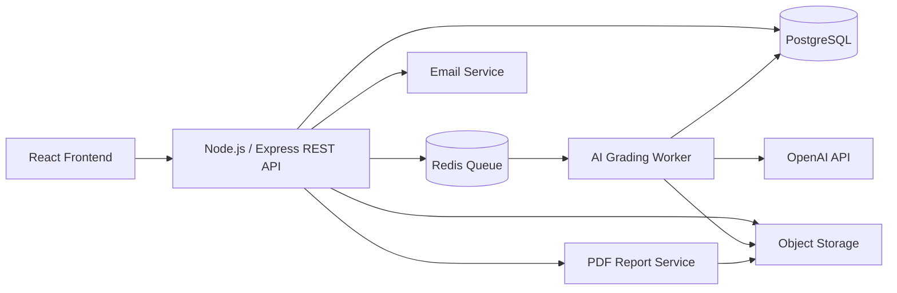
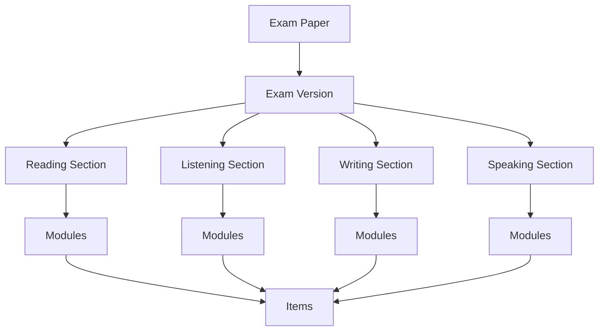
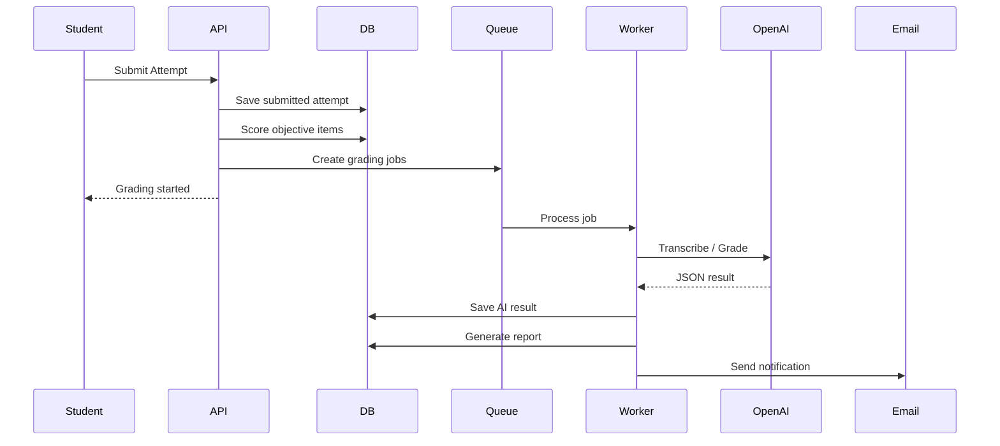

# 04. 系統架構與設計文件（Software Architecture Document）

> 文件版本：v1.0  
> 架構模式：React + Node.js/Express + REST API + PostgreSQL + Redis Queue + OpenAI API

---

## 1. 架構目標

本系統需要支援：

- 多機構 SaaS 架構
- 學生同步作答
- 大量自動儲存請求
- Speaking 錄音上傳
- Writing / Speaking 非同步 AI 批改
- 成績報告產生
- Email 通知
- 未來可擴充題庫、金流、個人帳號與多語言

---

## 2. 整體架構圖



---

## 3. 前端架構

### 3.1 技術

- React
- TypeScript
- React Router
- TanStack Query 或 SWR
- Zustand / Redux Toolkit
- UI Framework：Ant Design / MUI / Tailwind CSS

### 3.2 前端應用分區

| App | 使用者 | 說明 |
|---|---|---|
| Student App | 學生 | 考試作答、硬體檢查、報告查看 |
| Teacher Console | 老師 | 班級管理、考試指派、成績查看 |
| Admin Console | 管理者 | 機構管理、帳號管理、考卷管理、方案管理 |

### 3.3 Student App 特色

學生端需特別處理：

- 倒數計時
- 自動儲存
- 音檔播放
- 錄音
- 檔案上傳
- 斷線恢復
- 禁止返回某些題型
- 題目狀態同步

---

## 4. 後端架構

### 4.1 技術

- Node.js
- Express
- TypeScript
- Prisma ORM
- PostgreSQL
- Redis
- BullMQ
- Zod / Joi 驗證
- OpenAPI 文件

---

## 5. 後端模組切分

```txt
src/
├─ modules/
│  ├─ auth/
│  ├─ organizations/
│  ├─ users/
│  ├─ classes/
│  ├─ exams/
│  ├─ assignments/
│  ├─ attempts/
│  ├─ scoring/
│  ├─ ai-grading/
│  ├─ reports/
│  ├─ emails/
│  ├─ storage/
│  └─ audit/
├─ workers/
│  ├─ aiGradingWorker.ts
│  ├─ emailWorker.ts
│  └─ reportWorker.ts
├─ prisma/
├─ middlewares/
├─ utils/
└─ app.ts
```

---

## 6. 核心模組說明

## 6.1 Auth & Roles 模組

負責：

- 登入
- 登出
- Session 驗證
- 密碼重設
- 角色檢查
- organization scope 檢查

### 角色策略

```txt
Platform Admin
Organization Admin
Teacher
Student
```

所有 API 必須經過：

1. 是否登入
2. 是否有角色權限
3. 是否屬於同一 organization
4. 是否可存取該 resource

---

## 6.2 Organization 模組

負責：

- 建立機構
- 編輯機構
- 停用機構
- 方案與額度管理
- AI 使用量查詢

---

## 6.3 Exam 模組

負責：

- 固定整卷考卷
- 考卷版本
- Section
- Module
- Item
- Asset
- Answer Key

### 考卷結構



---

## 6.4 Attempt 模組

負責：

- 開始考試
- 儲存答案
- 儲存 section 狀態
- 上傳口說錄音
- 交卷
- 斷線恢復

### Attempt 狀態

```txt
not_started
hardware_check
in_progress
submitted
grading
completed
expired
error
```

---

## 6.5 Scoring 模組

負責：

- Reading 自動批改
- Listening 自動批改
- Build a Sentence 自動批改
- 計算 section score
- 計算 total score
- 建立 AI grading jobs

---

## 6.6 AI Grading Worker

負責：

- 處理 Writing AI 批改
- 處理 Speaking 語音轉文字
- 處理 Speaking AI 批改
- 驗證 AI JSON schema
- 記錄 token 與成本
- Retry 與失敗處理

### 背景任務流程



---

## 6.7 Report 模組

負責：

- 產生 Web 報告
- 產生 PDF
- 報告版本管理
- 老師人工評語
- 分數覆核

---

## 6.8 Email 模組

負責：

- 報告完成通知
- 密碼重設信
- 系統錯誤通知
- 寄送紀錄與 retry

---

## 7. 資料儲存設計

### 7.1 PostgreSQL

儲存：

- 使用者
- 機構
- 班級
- 考卷
- 作答
- 分數
- AI 結果
- 報告
- audit log

### 7.2 Object Storage

儲存：

- 聽力音檔
- 題目圖片
- 口說錄音
- PDF 報告

### 7.3 Redis

用途：

- BullMQ queue
- 短期 lock
- rate limit
- temporary state

---

## 8. REST API 設計原則

- 使用 `/api/v1`
- JSON request / response
- 統一錯誤格式
- 統一 pagination
- 統一 role middleware
- 統一 organization scope middleware

---

## 9. AI 整合設計

### 9.1 OpenAI API 用途

| 用途 | 說明 |
|---|---|
| Speech-to-text | Speaking 錄音轉文字 |
| Structured grading | Writing / Speaking 評分 |
| JSON schema | 固定 AI 回傳格式 |

### 9.2 Prompt 版本控管

每次 AI 批改需要紀錄：

- model
- prompt_version
- input payload
- output JSON
- token usage
- cost estimate
- grading status

---

## 10. 非功能設計

## 10.1 效能

### 作答儲存

- 選擇題點選即儲存
- 文字輸入 debounce 儲存
- section 切換立即儲存
- 交卷前 final save

### AI 批改

- 透過 queue 控制併發
- 超時 retry
- 限制單位時間 AI job 數量

---

## 10.2 安全

- HTTPS only
- HttpOnly cookie
- Password hashing
- CSRF 防護
- Rate limiting
- organization_id isolation
- signed URL
- audit log

---

## 10.3 可擴充

未來可擴充：

- 題庫抽題
- 多語言
- 個人購買
- 金流
- AI 自動出題
- 自動監考
- 學習建議系統

---

## 11. 部署建議

### MVP

| 元件 | 建議 |
|---|---|
| Frontend | Vercel |
| Backend | Render / Railway |
| DB | Supabase / Neon / Railway Postgres |
| Redis | Upstash / Railway Redis |
| Storage | Cloudflare R2 / AWS S3 |
| Email | Resend / SendGrid |
| AI | OpenAI API |

### Production

| 元件 | 建議 |
|---|---|
| Frontend | Vercel / CloudFront |
| Backend | AWS ECS / GCP Cloud Run |
| DB | Managed PostgreSQL |
| Redis | Managed Redis |
| Storage | S3 / R2 |
| Monitoring | Sentry + Grafana / Datadog |
