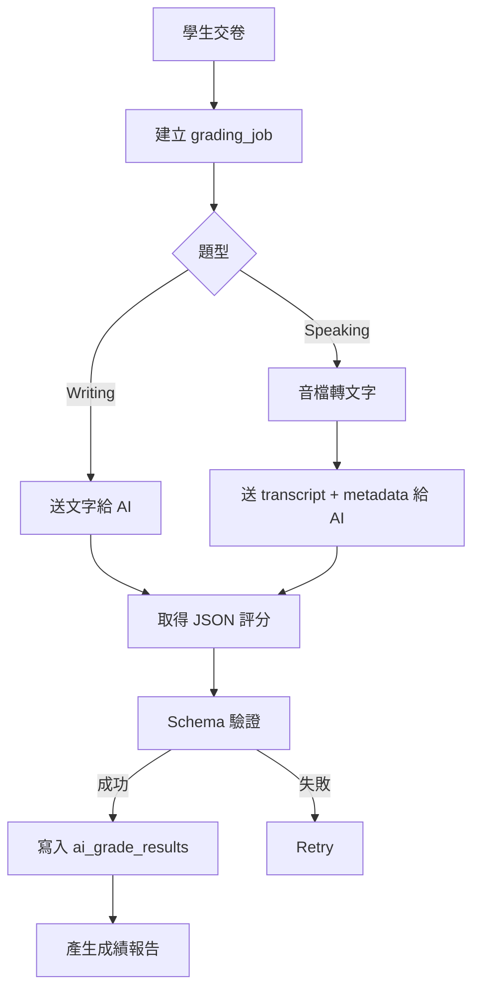

# 07. AI 批改規格與 Prompt 設計文件

> 文件版本：v1.0  
> 適用範圍：Writing / Speaking  
> AI 服務：OpenAI API  
> 輸出格式：Strict JSON Schema

---

## 1. AI 批改目標

AI 批改只處理：

- Writing：Write an Email、Academic Discussion
- Speaking：Listen and Repeat、Virtual Interview

不處理：

- Reading
- Listening
- Build a Sentence

---

## 2. 批改架構



---

## 3. 分數設計

### 3.1 對外分數

建議第一版使用：

| 科目 | 分數 |
|---|---|
| Reading | 0-30 |
| Listening | 0-30 |
| Writing | 0-30 |
| Speaking | 0-30 |
| Total | 0-120 |

> 注意：報告中應標示為「模擬分數」，不是 ETS 官方分數。

---

## 4. Writing 評分 Rubric

### 4.1 Write an Email

| 分項 | 權重 | 說明 |
|---|---:|---|
| Task Fulfillment | 25% | 是否完成題目要求 |
| Content Development | 20% | 內容是否完整具體 |
| Organization | 20% | 結構是否清楚 |
| Grammar Accuracy | 20% | 文法正確性 |
| Vocabulary Range | 15% | 字彙多樣性與適切性 |

---

### 4.2 Academic Discussion

| 分項 | 權重 | 說明 |
|---|---:|---|
| Relevance | 25% | 是否回應討論主題 |
| Idea Development | 25% | 是否有明確立場與支持理由 |
| Organization | 15% | 論述是否有邏輯 |
| Grammar Accuracy | 20% | 文法與句型 |
| Vocabulary Range | 15% | 字彙多樣性 |

---

## 5. Speaking 評分 Rubric

### 5.1 Listen and Repeat

| 分項 | 權重 | 說明 |
|---|---:|---|
| Content Accuracy | 40% | 是否覆誦到重要內容 |
| Fluency | 20% | 是否順暢 |
| Pronunciation | 20% | 發音清楚度 |
| Grammar / Structure | 10% | 句構完整度 |
| Completeness | 10% | 是否完整回答 |

---

### 5.2 Virtual Interview

| 分項 | 權重 | 說明 |
|---|---:|---|
| Task Fulfillment | 25% | 是否回答問題 |
| Content Development | 25% | 內容是否具體 |
| Fluency | 20% | 流暢度 |
| Grammar Accuracy | 15% | 文法 |
| Vocabulary Range | 15% | 字彙 |

---

## 6. AI 輸出 JSON Schema

### 6.1 通用輸出

```json
{
  "skill": "writing",
  "task_type": "academic_discussion",
  "overall_score": 24,
  "score_scale": "0-30",
  "rubric_scores": {
    "task_fulfillment": 4,
    "content_development": 4,
    "organization": 4,
    "grammar_accuracy": 3,
    "vocabulary_range": 4
  },
  "comments": {
    "overall": "The response is relevant and mostly well organized.",
    "task_fulfillment": "The student addresses the task clearly.",
    "content_development": "Ideas are developed, but examples could be more specific.",
    "organization": "The structure is easy to follow.",
    "grammar_accuracy": "There are some sentence-level errors.",
    "vocabulary_range": "Vocabulary is appropriate but not highly varied."
  },
  "strengths": [
    "Clear main idea",
    "Relevant response to the prompt"
  ],
  "weaknesses": [
    "Limited examples",
    "Some grammar errors"
  ],
  "improvement_suggestions": [
    "Add one concrete example.",
    "Use more complex sentence structures."
  ],
  "confidence_flag": "normal"
}
```

---

## 7. Writing Prompt Template

### 7.1 System Message

```txt
You are an English assessment rater for a TOEFL-style mock test platform.

You must evaluate the student's response according to the provided rubric.
Return only valid JSON that matches the required schema.
Do not include markdown.
Do not include explanations outside the JSON.

This is a mock test score, not an official TOEFL score.
```

---

### 7.2 User Message

```txt
Task Type:
{{task_type}}

Prompt:
{{prompt}}

Student Response:
{{student_response}}

Rubric:
{{rubric}}

Scoring Requirement:
- Give an overall score from 0 to 30.
- Give each rubric score from 1 to 5.
- Provide concise but useful comments.
- Provide strengths, weaknesses, and improvement suggestions.
- If the response is too short or off-topic, reflect that in the score.
- Return JSON only.
```

---

## 8. Speaking Prompt Template

### 8.1 System Message

```txt
You are an English speaking assessment rater for a TOEFL-style mock test platform.

You will evaluate a student's spoken response based on transcript and available audio metadata.
Return only valid JSON that matches the required schema.
Do not include markdown.
Do not include explanations outside the JSON.

This is a mock test score, not an official TOEFL score.
```

---

### 8.2 User Message

```txt
Task Type:
{{task_type}}

Question:
{{question_text}}

Expected Key Content:
{{expected_key_content}}

Student Transcript:
{{transcript_text}}

Audio Metadata:
- Duration: {{duration_seconds}} seconds
- Response time limit: {{response_time_seconds}} seconds

Rubric:
{{rubric}}

Scoring Requirement:
- Give an overall score from 0 to 30.
- Give each rubric score from 1 to 5.
- For pronunciation and fluency, infer cautiously from transcript and metadata.
- If audio/transcript quality is insufficient, set confidence_flag to "low_confidence".
- Return JSON only.
```

---

## 9. Speaking 語音轉文字

### 建議流程

1. 前端錄音為 webm / ogg。
2. 後端保存原始錄音。
3. Worker 呼叫 OpenAI speech-to-text。
4. 取得 transcript。
5. transcript 與題目一起送 grading prompt。
6. transcript 與錄音 metadata 寫入資料庫。

---

## 10. AI Retry 機制

| 情況 | 處理 |
|---|---|
| API timeout | Retry |
| Rate limit | 延後 retry |
| JSON parse failed | 使用修復 prompt retry |
| Schema validation failed | Retry |
| 連續失敗超過 3 次 | manual_review_required |

---

## 11. 成本控管

### 11.1 計費紀錄

每次 AI 呼叫記錄：

- organization_id
- attempt_id
- item_id
- model_name
- input_tokens
- output_tokens
- cached_tokens
- cost_estimate
- created_at

### 11.2 限制策略

- 每次交卷自動批改一次。
- 老師重批需消耗額度。
- 每份 attempt 設定最大 AI retry 次數。
- 每個 organization 可設定每月 AI 額度。
- 超過額度後禁止新 AI 批改或進入待付款狀態。

---

## 12. Prompt 版本管理

每次修改 prompt 需建立新版本：

| 欄位 | 說明 |
|---|---|
| prompt_key | writing_email / speaking_interview |
| version | v1.0 |
| content | prompt 內容 |
| model | 使用模型 |
| status | active / archived |
| created_by | 建立者 |
| created_at | 建立時間 |

---

## 13. 人工覆核

老師可對 AI 分數做：

- 查看原始 AI 評語
- 查看學生作答
- 查看 transcript
- 調整分數
- 補充老師評語
- 產生新版報告

系統需保留：

- AI 原始分數
- 老師修改後分數
- 修改者
- 修改原因
- 修改時間

---

## 14. 安全注意事項

- 不可把學生個資放入非必要 prompt。
- 不可將 OpenAI API key 暴露前端。
- 不應在 log 中完整保存 API key 或敏感資訊。
- 音檔應設定保存期限。
- 若學生要求刪除資料，需同步刪除音檔、作文與 AI 結果。
