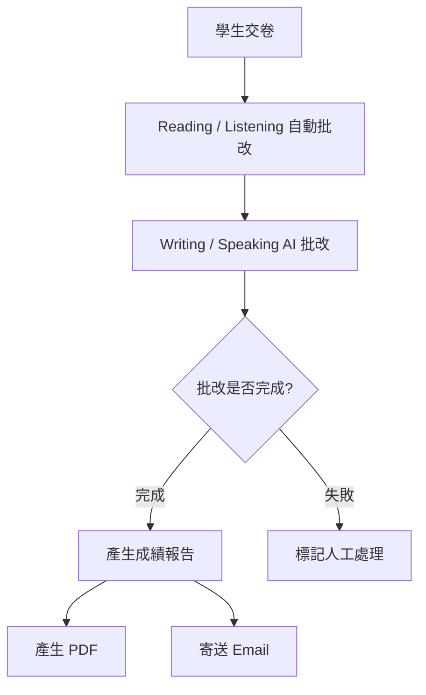

# 08. 成績報告與 Email 範本規格

> 文件版本：v1.0  
> 報告類型：四技能整合模擬測驗報告  
> 通知方式：Email + Web Report + PDF Export

---

## 1. 報告目標

成績報告需讓學生、老師與機構管理者清楚了解：

- 本次模考總體表現
- Reading / Listening / Writing / Speaking 四科分數
- 客觀題答對率
- Writing / Speaking AI 分項評語
- 老師人工補充評語
- 後續改進方向

---

## 2. 報告產生時機



---

## 3. 報告狀態

| 狀態 | 說明 |
|---|---|
| draft | 報告草稿 |
| grading | 批改中 |
| published | 報告完成 |
| manual_review_required | 需要人工處理 |
| revised | 老師已修改新版 |

---

## 4. Web 報告結構

## 4.1 Header

內容：

- 平台 Logo
- 報告標題：四技能英語模擬測驗報告
- 考卷名稱
- 報告產生時間
- 模擬成績聲明

範例：

```txt
Four-Skill English Mock Test Report
This is a mock test report and not an official TOEFL score report.
```

---

## 4.2 學生基本資料

| 欄位 | 說明 |
|---|---|
| Student Name | 學生姓名 |
| Email | 學生 Email |
| Organization | 機構 |
| Class | 班級 |
| Teacher | 指派老師 |
| Exam Name | 考卷名稱 |
| Exam Version | 考卷版本 |
| Completed At | 完成時間 |

---

## 4.3 分數總覽

| Skill | Score |
|---|---:|
| Reading | 24 / 30 |
| Listening | 23 / 30 |
| Writing | 22 / 30 |
| Speaking | 21 / 30 |
| Total | 90 / 120 |

### 顯示規則

- 若 AI 尚未完成，Writing / Speaking 顯示「批改中」。
- 若 AI 失敗，顯示「需老師確認」。
- 若老師修改分數，需標記「Teacher-reviewed」。

---

## 4.4 技能摘要

### Reading

- 題數
- 答對題數
- 答錯題數
- 正確率
- 分數

### Listening

- 題數
- 答對題數
- 答錯題數
- 正確率
- 分數

### Writing

- 總分
- 分項分數
- AI 評語
- 改進建議

### Speaking

- 總分
- 分項分數
- transcript 摘要
- AI 評語
- 改進建議

---

## 5. AI 評語顯示

### 5.1 Writing 區塊

顯示：

- Overall Comment
- Task Fulfillment
- Content Development
- Organization
- Grammar Accuracy
- Vocabulary Range
- Strengths
- Weaknesses
- Suggestions

---

### 5.2 Speaking 區塊

顯示：

- Overall Comment
- Content Relevance
- Fluency
- Pronunciation
- Grammar Accuracy
- Vocabulary Range
- Strengths
- Weaknesses
- Suggestions

---

## 6. 老師人工評語

老師可以新增：

- 總體評語
- 單科評語
- 學習建議
- 是否覆核 AI 分數

### 顯示方式

```txt
Teacher Comment
Your writing is well organized, but your examples need to be more specific.
```

---

## 7. PDF 報告規格

### 7.1 PDF 格式

- A4
- 直式
- 建議 2-4 頁
- 頁首固定平台名稱
- 頁尾顯示報告版本與產生時間

### 7.2 PDF 內容

頁面 1：

- 學生資料
- 考試資料
- 分數總覽
- 四科雷達圖或表格

頁面 2：

- Reading / Listening 統計
- Writing AI 評語

頁面 3：

- Speaking AI 評語
- 老師評語
- 改進建議

---

## 8. Email 通知規則

### 8.1 收件人

| 收件人 | 預設 |
|---|---|
| 學生 | 是 |
| 指派老師 | 是 |
| 機構管理者 | 可設定 |
| 平台管理者 | 否 |

---

### 8.2 寄送時機

- 報告 status = published
- PDF 已產生或 Web report 已可讀取
- Email log 不存在 sent 紀錄

---

## 9. Email Template：學生

### Subject

```txt
[模擬考結果] 你的四技能測驗報告已完成
```

### Body

```txt
Hi {{student_name}},

你的四技能英語模擬測驗報告已完成。

考試名稱：{{exam_title}}
完成時間：{{completed_at}}

成績摘要：
Reading：{{reading_score}}
Listening：{{listening_score}}
Writing：{{writing_score}}
Speaking：{{speaking_score}}
Total：{{total_score}}

查看完整報告：
{{report_url}}

下載 PDF：
{{pdf_url}}

提醒：此報告為模擬測驗結果，並非 ETS 官方 TOEFL 成績。

{{platform_name}}
```

---

## 10. Email Template：老師

### Subject

```txt
[學生模考完成] {{student_name}} 的四技能測驗報告已完成
```

### Body

```txt
Hi {{teacher_name}},

{{student_name}} 已完成 {{exam_title}}，報告已產生。

班級：{{class_name}}

成績摘要：
Reading：{{reading_score}}
Listening：{{listening_score}}
Writing：{{writing_score}}
Speaking：{{speaking_score}}
Total：{{total_score}}

查看學生報告：
{{report_url}}

查看班級成績：
{{class_result_url}}

{{platform_name}}
```

---

## 11. Email Template：AI 批改失敗

### Subject

```txt
[需要處理] 學生模考 AI 批改失敗
```

### Body

```txt
Hi {{teacher_name}},

{{student_name}} 的模考報告目前無法完成，原因是 AI 批改失敗。

考試名稱：{{exam_title}}
失敗項目：{{failed_skill}}
錯誤時間：{{failed_at}}

請進入後台查看並選擇重新批改或人工處理：
{{admin_url}}
```

---

## 12. 報告版本管理

當老師修改分數或新增評語時：

1. 建立新的 report_version。
2. 保留原始 AI 結果。
3. 記錄修改者與修改原因。
4. 可選擇是否重新寄送 Email。

---

## 13. 報告 URL 安全

報告連結建議：

- 登入後查看
- 或一次性 token 連結
- token 需有過期時間
- PDF 使用 signed URL
- 不可使用永久公開網址
