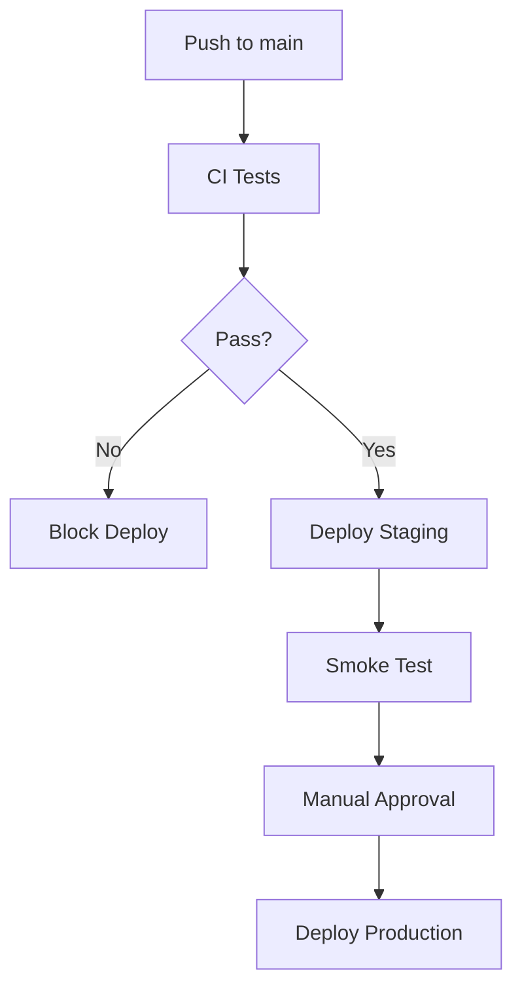

# 10. 部署、維運與安全性說明（DevOps & Security Spec）

> 文件版本：v1.0  
> 適用範圍：MVP 至正式商業化部署  
> 核心風險：考試中斷、錄音失敗、AI 批改失敗、資料外洩

---

## 1. 部署目標

系統部署需滿足：

- 穩定支援學生同時作答。
- 口說錄音功能可在 HTTPS 下正常使用。
- AI 批改不阻塞前端。
- 資料庫可備份與還原。
- 敏感資料不可公開。
- 不同機構資料隔離。
- 可監控 API、AI、Email、Storage 錯誤。

---

## 2. MVP 部署架構

| 元件 | 建議服務 |
|---|---|
| Frontend | Vercel |
| Backend API | Render / Railway / Fly.io |
| PostgreSQL | Supabase / Neon / Railway Postgres |
| Redis | Upstash / Railway Redis |
| Object Storage | Cloudflare R2 / AWS S3 |
| Email | Resend / SendGrid |
| Monitoring | Sentry |
| AI | OpenAI API |

---

## 3. Production 部署架構

| 元件 | 建議服務 |
|---|---|
| Frontend | Vercel / CloudFront |
| Backend API | AWS ECS / GCP Cloud Run / Kubernetes |
| Database | Managed PostgreSQL |
| Redis | Managed Redis |
| Storage | AWS S3 / Cloudflare R2 |
| CDN | CloudFront / Cloudflare |
| Monitoring | Datadog / Grafana / Sentry |
| Secrets | AWS Secrets Manager / GCP Secret Manager |

---

## 4. 環境切分

至少需要三個環境：

| 環境 | 用途 |
|---|---|
| local | 開發 |
| staging | 測試與 Demo |
| production | 正式營運 |

### 4.1 環境隔離原則

- 不同環境使用不同 DB。
- 不同環境使用不同 OpenAI API key。
- 不同環境使用不同 Email sandbox / production key。
- Staging 不使用真實學生資料。
- Production secrets 不可出現在開發者本機或 GitHub。

---

## 5. CI/CD

### 5.1 Pull Request 檢查

每次 PR 需執行：

- TypeScript type check
- ESLint
- Unit tests
- API integration tests
- Prisma migration check
- Build test

### 5.2 部署流程



---

## 6. 資料庫維運

### 6.1 備份策略

| 類型 | 頻率 |
|---|---|
| Full backup | 每日 |
| WAL / PITR | 依服務支援 |
| 手動備份 | 重大 migration 前 |
| 還原演練 | 每月一次 |

### 6.2 Migration 策略

- 使用 Prisma migration。
- 禁止 production 直接手動改 schema。
- 破壞性 migration 需先備份。
- 大表欄位變更需分階段部署。

---

## 7. Log 與監控

## 7.1 必須記錄的 Log

| 類型 | 內容 |
|---|---|
| API Error | request_id、user_id、organization_id、path、error |
| Auth Log | login success / failure |
| Audit Log | 建立考卷、指派考試、改分、重批 |
| AI Log | model、prompt_version、token、status、error |
| Email Log | template、recipient、status、error |
| Upload Log | file size、mime type、status |

---

## 7.2 告警條件

| 條件 | 告警 |
|---|---|
| API 5xx 過高 | Slack / Email |
| AI job failed 過高 | Slack / Email |
| Queue backlog 過高 | Slack / Email |
| DB CPU 過高 | Slack / Email |
| Email failed 過高 | Slack / Email |
| Storage upload failed 過高 | Slack / Email |

---

## 8. 安全性設定

## 8.1 HTTPS

- 全站強制 HTTPS。
- 啟用 HSTS。
- 禁止 mixed content。
- Speaking 錄音功能正式環境必須 HTTPS。

---

## 8.2 Cookie 與 Session

建議 cookie：

```http
Set-Cookie: __Host-session=...; HttpOnly; Secure; SameSite=Lax; Path=/
```

### Session 規則

- Access session 短效。
- Refresh token 或 session rotation。
- 登出後失效。
- 密碼重設後失效。
- 高風險操作可要求重新驗證。

---

## 8.3 密碼安全

- 使用 Argon2id 或 bcrypt。
- 不保存明碼。
- 最小長度建議 12-15 字元。
- 禁止常見弱密碼。
- 登入失敗節流。
- 不強制頻繁改密碼，除非疑似外洩。

---

## 8.4 API Key 安全

- OpenAI API key 僅保存在後端。
- 使用環境變數或 secret manager。
- 不寫入 Git。
- 不輸出到 log。
- Staging / Production 使用不同 key。
- 定期輪換 key。

---

## 8.5 Object Storage 安全

| 檔案 | 存取方式 |
|---|---|
| 聽力音檔 | 授權後 signed URL |
| 題目圖片 | 授權後 signed URL 或 CDN |
| 口說錄音 | signed URL，嚴禁公開 |
| PDF 報告 | signed URL，有效期限 |
| 學生作文 | DB 權限控管 |

---

## 9. 多機構資料隔離

所有資料查詢必須加入：

```ts
organizationId: currentUser.organizationId
```

Platform Admin 例外，但需 audit log。

### 9.1 防止跨機構存取

- Middleware 檢查 organization_id。
- Service 層再次檢查。
- DB 可考慮 Row-Level Security。
- 測試需包含 cross-tenant access cases。

---

## 10. AI 維運

### 10.1 AI 使用量監控

記錄：

- organization_id
- model
- input_tokens
- output_tokens
- cost_estimate
- request_status
- created_at

### 10.2 AI 額度限制

- organization 層設定月額度。
- 超過額度不再自動批改。
- 老師重批需消耗額度。
- Platform Admin 可手動加額度。

### 10.3 AI 失敗處理

| 錯誤 | 處理 |
|---|---|
| rate limit | 延後 retry |
| timeout | retry |
| JSON invalid | schema repair retry |
| audio transcription failed | retry transcription |
| persistent failure | manual_review_required |

---

## 11. Email 維運

- Email 使用 queue 發送。
- 寄送結果寫入 email_logs。
- 支援 retry。
- 避免同一報告重複寄送。
- 支援測試模式，防止 staging 寄給真實學生。

---

## 12. 隱私與資料刪除

### 12.1 學生資料

學生資料包含：

- 姓名
- Email
- 班級
- 成績
- 作文
- 錄音
- AI 評語

### 12.2 刪除流程

當學生要求刪除資料：

1. 驗證身份與機構要求。
2. 停用帳號。
3. 刪除或匿名化個資。
4. 刪除錄音檔。
5. 依政策保留必要 audit log。
6. 記錄刪除時間。

---

## 13. 錄音保存期限

建議機構可設定：

| 選項 | 說明 |
|---|---|
| 30 天 | 預設 |
| 90 天 | 補習班常用 |
| 180 天 | 長期追蹤 |
| 永久 | 不建議，除非有明確同意 |

---

## 14. 災難復原

### 14.1 RTO / RPO 建議

| 指標 | MVP | Production |
|---|---:|---:|
| RTO | 24 小時 | 4 小時 |
| RPO | 24 小時 | 1 小時 |

### 14.2 災難情境

| 情境 | 處理 |
|---|---|
| DB 故障 | 從 backup / PITR 還原 |
| Storage 檔案遺失 | 從備份 bucket 還原 |
| AI API 不可用 | 暫停 AI 批改，保留 queue |
| Email service 不可用 | 延後寄送 |
| Backend 當機 | 自動重啟與告警 |

---

## 15. 上線前安全 Checklist

- [ ] HTTPS 啟用
- [ ] HSTS 啟用
- [ ] API key 不在前端
- [ ] DB backup 啟用
- [ ] Session cookie 設定正確
- [ ] 密碼雜湊
- [ ] 多機構隔離測試通過
- [ ] Signed URL 啟用
- [ ] Upload MIME type 驗證
- [ ] AI 成本監控啟用
- [ ] Email retry 啟用
- [ ] Audit log 啟用
- [ ] Sentry 或等效監控啟用
